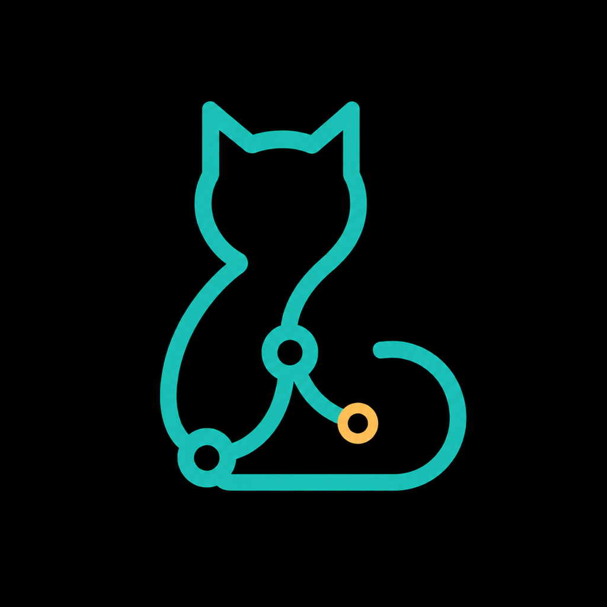

# jjcat

<p align="center">
  
</p>

<p align="center">
  <strong>흩어진 jj 저장소를, 한 창에서.</strong><br>
  <sub>All your jj repos, one window.</sub>
</p>

jjcat은 로컬과 Remote SSH 환경의 여러 Jujutsu 저장소를 탭으로 오가며 살펴보는
local-first 데스크톱 repository cockpit이다. 편집기 workspace나 브라우저 서버에
종속되지 않고 change graph, bookmark, working copy와 diff를 한 세션에서 다룬다.

- **Local and SSH parity** — 로컬 폴더와 OpenSSH host의 저장소를 같은 repository rail,
  tab과 quick switcher에서 전환한다.
- **Dense change cockpit** — compact multi-lane DAG, local/remote bookmark, last-fetched
  divergence와 unified/side-by-side diff를 한 화면에서 읽는다.
- **Local-first by design** — source code, SSH credential과 private host inventory를 hosted
  service로 전송하지 않는다.

## Current Status

jjcat은 현재 **pre-alpha P2**다. local/SSH 저장소 등록, persistent tab과 quick switcher,
cached background refresh, multi-lane history, bounded file diff, editor/terminal handoff와
read-only operation recovery preview가 동작한다.

아직 실제 repository mutation은 제공하지 않는다. fetch, new, edit, describe와 history
shaping은 [P3 Safe Shaping](docs/roadmap.md#p3-safe-shaping)에서 precondition, preview와
recovery contract를 갖춘 뒤 단계적으로 추가한다.

## Quick Start

필요한 도구는 `pnpm`, `cargo`를 포함한 Rust toolchain, 지원되는 Jujutsu CLI다. 현재
지원하는 `jj` 하한은 0.30.0이며 desktop build에는 Tauri 2의 platform prerequisite도
필요하다.

```sh
pnpm install
pnpm tauri dev
```

`pnpm dev`는 Vite frontend만 브라우저에서 실행한다. native folder picker, local process와
SSH integration까지 확인하려면 `pnpm tauri dev`를 사용한다.

앱이 열리면 repository rail의 `+`에서 다음 흐름으로 시작한다.

1. **Local**에서 폴더를 고르거나 `~/...` 또는 absolute path를 입력한다.
2. **SSH**에서 OpenSSH host alias를 선택하고 remote folder browser로 저장소를 고른다.
3. tab 또는 quick switcher로 저장소를 전환한다.
4. change와 file을 선택해 graph, metadata와 diff를 살펴본다.

SSH key와 agent는 jjcat이 저장하지 않고 사용자의 OpenSSH 설정을 그대로 사용한다.

## Product Principles

- **Repository first:** 연결 방식보다 사용자가 관리하는 저장소와 상태를 먼저 보여준다.
- **Fast switching:** cached view를 즉시 표시하고 refresh는 background에서 수행한다.
- **Dense by default:** change ID, description, bookmark와 핵심 metadata를 compact row에
  배치한다.
- **Safe shaping:** mutation은 대상 revision, 예상 operation, 실행 범위와 recovery 경로를
  확인할 수 있어야 한다.
- **Keyboard and pointer:** tab, quick switcher, graph navigation과 향후 drag-and-drop
  shaping에 동등한 keyboard 흐름을 제공한다.

자세한 제품 범위와 non-goal은 [Product Contract](docs/PRODUCT.md), runtime과 transport
경계는 [Architecture](docs/ARCHITECTURE.md)에서 관리한다.

## Project Navigation

- 현재 구현 상태: [Project Status](docs/status.md)
- milestone 순서: [Product Roadmap](docs/roadmap.md)
- architecture와 security boundary: [Architecture](docs/ARCHITECTURE.md)
- public-ready 기록 기준: [Publication Policy](docs/PUBLICATION.md)
- contributor guide: [CONTRIBUTING.md](CONTRIBUTING.md)
- security report와 dependency 경계: [SECURITY.md](SECURITY.md)

AI agent의 진입점은 [AGENTS.md](AGENTS.md)와 [Agent Harness](docs/agent-harness.md)다.
무컨텍스트 handoff는 [docs/HANDOFF.md](docs/HANDOFF.md)에서 현재 상태와 다음 작업을
확인한다.

## Development

전체 로컬 검증:

```sh
scripts/check.sh
```

새 작업 bootstrap:

```sh
scripts/start-work.sh --work-id <work-id>
```

로컬 change 검증과 설명 정리:

```sh
scripts/finalize-change.sh --message "docs: describe the milestone"
```

push, visibility 변경, package publish와 release는 별도 사용자 결정과 publication gate를
요구한다.

## Public Repository Boundary

tracked content는 remote visibility와 무관하게 `public-ready` 기준을 적용한다. 제품
계약, 합성 fixture, source code와 재현 가능한 검증 규칙만 기록하고 실제 SSH host,
repository checkout path, credential, private inventory, agent 대화·memory·raw tool log는
기록하지 않는다.

[GitHub origin](https://github.com/zrma/jjcat)은 public으로 구성했으며 source code는
Apache License 2.0으로 제공한다.

## License

jjcat은 [Apache License 2.0](LICENSE)으로 제공한다.
