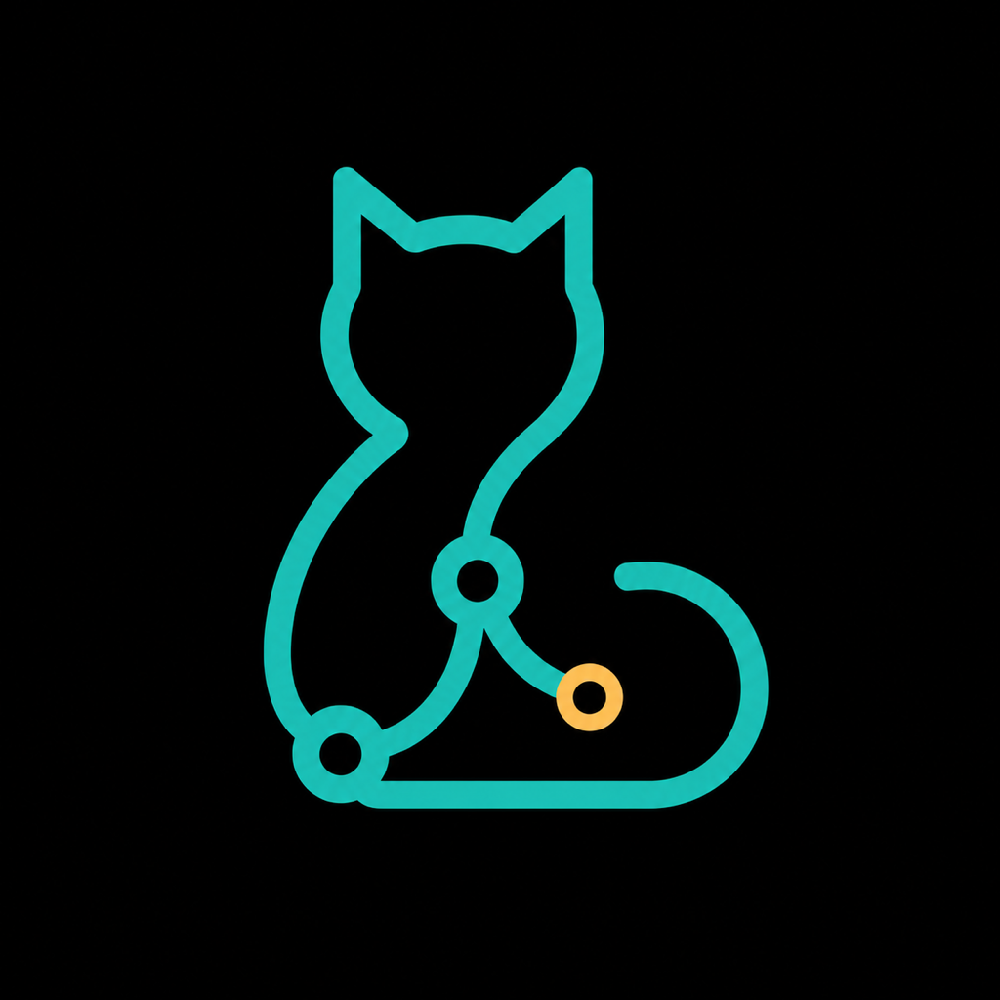

# jjcat

<p align="center">
  
</p>

<p align="center">
  <strong>흩어진 jj 저장소를, 한 창에서.</strong><br>
  <sub>All your jj repos, one window.</sub>
</p>

jjcat은 로컬과 Remote SSH 환경의 여러 Jujutsu 저장소를 탭으로 오가며 살펴보는
local-first 데스크톱 repository cockpit이다. 편집기 workspace나 브라우저 서버에
종속되지 않고 change graph, bookmark, working copy와 diff를 한 세션에서 다룬다.

- **Local and SSH parity** — 로컬 폴더와 OpenSSH host의 저장소를 같은 repository rail,
  tab과 quick switcher에서 전환한다.
- **Dense change cockpit** — compact multi-lane DAG, local/remote bookmark, last-fetched
  divergence와 unified/side-by-side diff를 한 화면에서 읽는다.
- **Local-first by design** — source code, SSH credential과 private host inventory를 hosted
  service로 전송하지 않는다.

## Current Status

jjcat은 P3 기능과 `v0.9.0` macOS public beta 출고를 완료하고, updater-enabled
bootstrap인 `v0.9.1`과 live in-app update를 검증한 `v0.9.2`에 이어 **v0.9.3**에서
창 배치 복원과 단일-confirm mutation UX를 제공한다.
local/SSH 저장소 직접 등록과 folder source discovery, drag-reorder가 가능한 persistent
tab과 quick switcher, cached background refresh, multi-lane history, bounded file diff와
editor/terminal handoff가 동작한다.

모든 repository mutation은 repository, exact target과 expected operation을 고정한 backend
preview token을 거친다. new/edit/describe/fetch, rebase/squash/file-level split/abandon,
protected empty-change pruning, multi-step undo/redo, bookmark move와 explicit push를 제공한다.
Undo/Redo는 별도 확인 dialog 없이 한 번의 입력으로 실행하고 나머지 shaping 작업은 실행 전
preview를 보여준다. `jj undo`로 복원 가능한 local preview는 `Enter`/`Y`로 실행하고
`Esc`/`N`으로 취소할 수 있다. directory를 삭제하는 workspace removal과 remote push는
명시적 button 조작만 허용한다. 0.9.0 version contract와 macOS app/DMG build surface는
[P4 Distribution](docs/roadmap.md#p4-distribution)에서 출고했다. 첫 public beta는
번들 무결성용 ad-hoc 서명만 적용하고 Developer ID 서명과 공증 없이 Apple Silicon용
prerelease로 배포하며, SHA-256 checksum, 표준 Gatekeeper 최초 실행 안내, clean
install/restart와 local/SSH smoke evidence를 release contract로 삼는다. 자세한 설치 경계는
[v0.9.0 release notes](docs/releases/v0.9.0.md)에 기록했다. `v0.9.0` 자체에는 updater가
없다. available-only download와 signed in-app update runtime은 다음 manual bootstrap용으로
구현했다. password-protected persistent updater key는 owner-controlled recovery
archive와 GitHub Actions secret/variable에 구성했다. `v0.9.1` manual bootstrap,
rolling beta channel과 `v0.9.2`를 게시했으며, 설치된 `v0.9.1`에서 공개 updater의
download/verify/install/explicit-restart를 거쳐 `v0.9.2`로 실행되는 경로를 검증했다.
[v0.9.2 release notes](docs/releases/v0.9.2.md)는 이 in-app update 절차를 설명한다.
[v0.9.3 release notes](docs/releases/v0.9.3.md)는 창/inspector 배치 복원과 단순화한
mutation 확인 정책을 설명한다.
유료 Apple Developer Program을 사용하는 Developer ID signing/notarization은 현재
계획된 작업이 아니며, 배포량 또는 Gatekeeper 지원 비용이 구독을 정당화할 때만 새
distribution decision으로 재검토한다.

## Quick Start

필요한 도구는 `pnpm`, `cargo`를 포함한 Rust toolchain, 지원되는 Jujutsu CLI다. 현재
지원하는 `jj` 하한은 0.30.0이며 desktop build에는 Tauri 2의 platform prerequisite도
필요하다.

```sh
pnpm install
pnpm tauri dev
```

`pnpm dev`는 Vite frontend만 브라우저에서 실행한다. native folder picker, local process와
SSH integration까지 확인하려면 `pnpm tauri dev`를 사용한다.

앱이 열리면 repository rail의 `+`에서 다음 두 흐름 중 하나로 시작한다.

1. 저장소 하나만 열려면 **Open repository…**에서 local 폴더를 고르거나 OpenSSH host와
   remote folder를 선택한다. local은 `~/...` 또는 absolute path 직접 입력도 허용한다.
2. 여러 저장소의 상위 폴더를 관리하려면 **Add repository source…**에서 local 또는 SSH
   source folder와 bounded scan depth를 정한다.
3. source 아래에서 발견한 저장소를 double-click하거나 `Enter`로 열면 기존 tab을
   재사용하거나 새 persistent tab을 연다. source의 rescan과 registry-only removal도
   같은 tree에서 수행한다.
4. tab 또는 quick switcher로 저장소를 전환하고 tab을 끌어 순서를 정리한다.
5. change와 file을 선택해 graph, metadata와 diff를 살펴본다.
6. `Change` 메뉴를 사용하거나 change를 다른 change 위에 끌어 mutation preview를 연다.
7. toolbar의 **Undo/Redo** 또는 `⌘Z`/`⌘⇧Z` (`Ctrl+Z`/`Ctrl+Y`)로 한 operation씩 바로 이동한다.
8. 되돌릴 수 있는 local mutation preview에서는 `Enter`/`Y`로 실행하고 `Esc`/`N`으로 취소한다.

SSH key와 agent는 jjcat이 저장하지 않고 사용자의 OpenSSH 설정을 그대로 사용한다.
Repository source를 제거해도 source folder, 발견한 repository 또는 이미 연 tab의
filesystem content는 삭제하지 않는다.

## Product Principles

- **Repository first:** 연결 방식보다 사용자가 관리하는 저장소와 상태를 먼저 보여준다.
- **Fast switching:** cached view를 즉시 표시하고 refresh는 background에서 수행한다.
- **Dense by default:** change ID, description, bookmark와 핵심 metadata를 compact row에
  배치한다.
- **Safe shaping:** mutation은 대상 revision, 예상 operation, 실행 범위와 recovery 경로를
  확인할 수 있어야 한다.
- **Keyboard and pointer:** tab, quick switcher, graph navigation과 drag-and-drop shaping에
  동등한 keyboard 흐름을 제공한다.

자세한 제품 범위와 non-goal은 [Product Contract](docs/PRODUCT.md), runtime과 transport
경계는 [Architecture](docs/ARCHITECTURE.md)에서 관리한다.

## Project Navigation

- 현재 구현 상태: [Project Status](docs/status.md)
- milestone 순서: [Product Roadmap](docs/roadmap.md)
- architecture와 security boundary: [Architecture](docs/ARCHITECTURE.md)
- public-ready 기록 기준: [Publication Policy](docs/PUBLICATION.md)
- contributor guide: [CONTRIBUTING.md](CONTRIBUTING.md)
- security report와 dependency 경계: [SECURITY.md](SECURITY.md)

AI agent의 진입점은 [AGENTS.md](AGENTS.md)와 [Agent Harness](docs/agent-harness.md)다.
무컨텍스트 handoff는 [docs/HANDOFF.md](docs/HANDOFF.md)에서 현재 상태와 다음 작업을
확인한다.

## Development

전체 로컬 검증:

```sh
scripts/check.sh
```

새 작업 bootstrap:

```sh
scripts/start-work.sh --work-id <work-id>
```

로컬 change 검증과 설명 정리:

```sh
scripts/finalize-change.sh --message "docs: describe the milestone"
```

push, visibility 변경, package publish와 release는 별도 사용자 결정과 publication gate를
요구한다.

## Public Repository Boundary

tracked content는 remote visibility와 무관하게 `public-ready` 기준을 적용한다. 제품
계약, 합성 fixture, source code와 재현 가능한 검증 규칙만 기록하고 실제 SSH host,
repository checkout path, credential, private inventory, agent 대화·memory·raw tool log는
기록하지 않는다.

[GitHub origin](https://github.com/zrma/jjcat)은 public으로 구성했으며 source code는
Apache License 2.0으로 제공한다.

## License

jjcat은 [Apache License 2.0](LICENSE)으로 제공한다.
